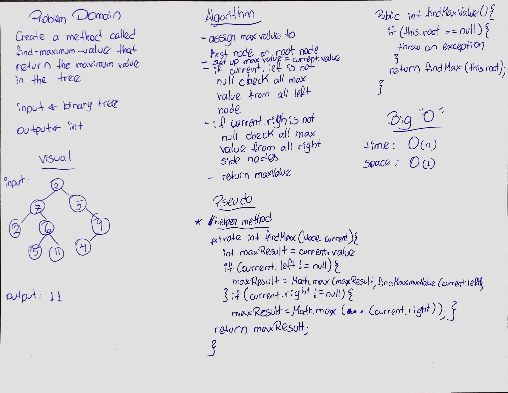

### DATA STRUCTURE
[CODE CHALLENGE 6](#challenge-6)</br>
[CODE CHALLENGE 7](#challenge-7)</br>
[CODE CHALLENGE 8](#challenge-8)</br>
[CODE LAB 10](#lab-10)</br>
[CODE CHALLENGE 11](#challenge-11)</br>
[CODE CHALLENGE 12](#challenge-12)</br>
[CODE CHALLENGE 13](#challenge-13)</br>
[CODE CHALLENGE 15](#challenge-15)</br>
[CODE CHALLENGE 16](#challenge-16)</br>
[CODE CHALLENGE 17](#challenge-17)</br>
[CODE CHALLENGE 18](#challenge-18)</br>
[CODE CHALLENGE SORT](#challenge-SORT)</br>
[CODE CHALLENGE MERGE-SORT](#challenge-MERGE-SORT)</br></br></br>


<a name="challenge-6">code challenge 6</a></br></br>
# CODE CHALLENGE 6
[LINK TO CODE](https://github.com/daesy13/data-structures-and-algorithms/blob/master/code401challenges/src/main/java/code401challenges/linkedList/LinkedList.java)</br>
[LINK TO TEST](https://github.com/daesy13/data-structures-and-algorithms/blob/master/code401challenges/src/test/java/code401challenges/linkedList/LinkedListTest.java)</br></br>

# Challenge Summary
Creating a methods to insert new linkedlist values, as well as adding before the target and after the target value.</br>

## Challenge Description
```.append(value)``` which adds a new node with the given value to the end of the list</br>
```.insertBefore(value, newVal)``` which add a new node with the given newValue immediately before the first value node</br>
```.insertAfter(value, newVal)``` which add a new node with the given newValue immediately after the first value node</br></br>

## Approach & Efficiency
**.append(value)**</br>
Mainly use while loop to iterate thru linkedlist, create a place holder for current value and compare until found last item with value null and add new node as next.</br>
**.insertBefore(target, value)**</br>
Used while current is not equal to target **value** then go to next.
if stops it will stops before hitting target, which is the node before the target, and proceed to add new node, and connect to the target node.</br>
**.insertAfter(target, value)**</br>
Used while current is not equal to target **node** then got to next.
if stops it will stops at target and proceed to add new node after the target.</br>

**Big O** is O(n)

## Solution
</br></br><a href="#top">Back to top</a>

<a name="challenge-7">code challenge 7</a></br></br>
# CODE CHALLENGE 7
[LINK TO CODE](https://github.com/daesy13/data-structures-and-algorithms/blob/master/code401challenges/src/main/java/code401challenges/linkedList/LinkedList.java)</br>
[LINK TO TEST](https://github.com/daesy13/data-structures-and-algorithms/blob/master/code401challenges/src/test/java/code401challenges/linkedList/LinkedListTest.java)</br></br>

# Challenge Summary
Creating a methods to insert a index location starting from the end of the LinkedList.</br>

## Challenge Description
Write a method for the Linked List class which takes a number, k, as a parameter. Return the node’s value that is k from the end of the linked list. You have access to the Node class and all the properties on the Linked List class as well as the methods created in previous challenges.</br></br>

## Approach & Efficiency
Do a while loop to count the length of the linked list. Once found the lenght of my linked list. Subtract the length of the linked list with the k value to find the k value. Which it will count the length minus k. After that do a while loop until it stops to the new length and will return the value in k.</br>

**Big O** is O(n)

## Solution
</br></br><a href="#top">Back to top</a>

<a name="challenge-8">code challenge 8</a></br></br>
# CODE CHALLENGE 8
[LINK TO CODE](https://github.com/daesy13/data-structures-and-algorithms/blob/master/code401challenges/src/main/java/code401challenges/linkedList/LinkedList.java)</br>
[LINK TO TEST](https://github.com/daesy13/data-structures-and-algorithms/blob/master/code401challenges/src/test/java/code401challenges/linkedList/LinkedListTest.java)</br></br>

# Challenge Summary
Creating a methods that takes two LinkedList and merge into one LinkedList.</br>

## Challenge Description
Write a function called mergeLists which takes two linked lists as arguments. Zip the two linked lists together into one so that the nodes alternate between the two lists and return a reference to the head of the zipped list. Try and keep additional space down to O(1). You have access to the Node class and all the properties on the Linked List class as well as the methods created in previous challenges.</br></br>

## Approach & Efficiency
Create a recursion that goes to each node and assign the next to be the first node from the second linked list.</br>

**Big O** is O(n)

## Solution
</br></br><a href="#top">Back to top</a>

<a name="lab-10">lab 10</a></br></br>
# LAB 10
[LINK TO CODE](https://github.com/daesy13/data-structures-and-algorithms/tree/master/code401challenges/src/main/java/code401challenges/stacksandqueues)</br>
[LINK TO TEST](https://github.com/daesy13/data-structures-and-algorithms/tree/master/code401challenges/src/test/java/code401challenges/stacksandqueues)</br></br>

# Lab Summary
Creating methods to add nodes and delete nodes for Stacks and Queues with their respective logic.</br>

## Lab Description
* Create a Node class that has properties for the value stored in the Node, and a pointer to the next node.
* Create a Stack class that has a top property. It creates an empty Stack when instantiated.
  * This object should be aware of a default empty value assigned to top when the stack is created.
  * Define a method called push which takes any value as an argument and adds a new node with that value to the top of the stack with an O(1) Time performance.
  * Define a method called pop that does not take any argument, removes the node from the top of the stack, and returns the node’s value.
  * Define a method called peek that does not take an argument and returns the value of the node located on top of the stack, without removing it from the stack.
  * Define a method called isEmpty that does not take an argument, and returns a boolean indicating whether or not the stack is empty.
* Create a Queue class that has a front property. It creates an empty Queue when instantiated.
This object should be aware of a default empty value assigned to front when the queue is created.
  * Define a method called enqueue which takes any value as an argument and adds a new node with that value to the back of the queue with an O(1) Time performance.
  * Define a method called dequeue that does not take any argument, removes the node from the front of the queue, and returns the node’s value.
  * Define a method called peek that does not take an argument and returns the value of the node located in the front of the queue, without removing it from the queue.
  * Define a method called isEmpty that does not take an argument, and returns a boolean indicating whether or not the queue is empty.
* Any exceptions or errors that come from your code should be semantic, capturable errors. For example, rather than a default error thrown by your language, your code should raise/throw a custom, semantic error that describes what went wrong in calling the methods you wrote for this lab.
* Be sure to follow your languages best practices for naming conventions.</br></br><a href="#top">Back to top</a>

<a name="challenge-11">challenge 11</a></br></br>
# CODE CHALLENGE 11
[LINK TO CODE](https://github.com/daesy13/data-structures-and-algorithms/blob/master/code401challenges/src/main/java/code401challenges/stacksandqueues/PseudoQueue.java)</br>
[LINK TO TEST](https://github.com/daesy13/data-structures-and-algorithms/blob/master/code401challenges/src/test/java/code401challenges/stacksandqueues/PseudoQueueTest.java)</br></br>

# Challenge Summary
Create 2 methods enqueue and dequeue using Stack methods to work as a queue using the FIFO approach.</br>

## Challenge Description
Create a brand new PseudoQueue class. Do not use an existing Queue. Instead, this PseudoQueue class will implement our standard queue interface (the two methods listed below), but will internally only utilize 2 Stack objects. Ensure that you create your class with the following methods:</br>

* enqueue(value) which inserts value into the PseudoQueue, using a first-in, first-out approach.
* dequeue() which extracts a value from the PseudoQueue, using a first-in, first-out approach.
The Stack instances have only push, pop, and peek methods. You should use your own Stack implementation. Instantiate these Stack objects in your PseudoQueue constructor.</br></br>

## Approach & Efficiency
* Create 2 empty stacks for place holder.
* Create method enqueue and push values into enqueue stack place holder.
* Create method dequeue, and while the stack is not empty, add the values to the empty stack from back to first and delete them from their original stack. Which it will put the values in reverse.
* return the pop value which will be the first item in from the original stack.
</br>

**Big O** is O(n)

## Solution
</br></br><a href="#top">Back to top</a>

<a name="challenge-12">challenge 12</a></br> 
# CODE CHALLENGE 12
[LINK TO CODE](https://github.com/daesy13/data-structures-and-algorithms/tree/master/code401challenges/src/main/java/code401challenges/utilities)</br></br>
# Challenge Summary
Creating two Queue methods one enqueue to add new objects and another dequeue to delete the first item that enter previously .</br>

## Challenge Description
Create a class called AnimalShelter which holds only dogs and cats. The shelter operates using a first-in, first-out approach.</br>
Implement the following methods:
enqueue(animal): adds animal to the shelter. animal can be either a dog or a cat object.</br>
dequeue(pref): returns either a dog or a cat. If pref is not "dog" or "cat" then return null..</br></br>

**Big O** is O(n)

## Solution

</br></br>
<a href="#top">Back to top</a>

<a name="challenge-13">code challenge 13</a></br></br>
# CODE CHALLENGE 13
[LINK TO CODE](https://github.com/daesy13/data-structures-and-algorithms/blob/master/code401challenges/src/main/java/code401challenges/utilities/MultiBracketValidation.java)</br>
[LINK TO TEST](https://github.com/daesy13/data-structures-and-algorithms/blob/master/code401challenges/src/test/java/code401challenges/utilities/MultiBracketValidationTest.java)</br></br>

# Challenge Summary
Creating a methods takes a string and iterates each item on the string to verify if there is matching open and close brackets.</br>

## Challenge Description
Your function should take a string as its only argument, and should return a boolean representing whether or not the brackets in the string are balanced. There are 3 types of brackets:</br>

* Round Brackets : ```()```
* Square Brackets : ```[]```
* Curly Brackets : ```{}```

## Approach & Efficiency
Create a method that takes a string. Iterate each character of the string. Verify if each item in the string is an open bracket and if is a bracket it will store it into a temporary stack place holder.</br>check if the following characters have any close bracket matching the open one.</br>If they do will pop the open bracket inside the place holder.</br>If at the end, the place holder is empty it means that matching brackets were found in the string.
</br>

**Big O** is O(n)

## Solution
</br></br><a href="#top">Back to top</a>
<!-- ****** -->
<a name="challenge-15">code challenge 15</a></br></br>
# CODE CHALLENGE 15
[LINK TO CODE](https://github.com/daesy13/data-structures-and-algorithms/tree/master/code401challenges/src/main/java/code401challenges/tree)</br>
[LINK TO TEST](https://github.com/daesy13/data-structures-and-algorithms/tree/master/code401challenges/src/test/java/code401challenges/treeTest)</br></br>

# Trees
Create methods that creates nodes to build a BinaryTree using preOrder, inOrder, and postOrder methods.
Also create a method to create BinarySearchTree. 
</br>

## Challenge Description
* Create a Node class that has properties for the value stored in the node, the left child node, and the right child node.
* Create a BinaryTree class
  * Define a method for each of the depth first traversals called ```preOrder```, ```inOrder```, and ```postOrder``` which returns an array of the values, ordered appropriately.
* Any exceptions or errors that come from your code should be semantic, capturable errors. For example, rather than a default error thrown by your language, your code should raise/throw a custom, semantic error that describes what went wrong in calling the methods you wrote for this lab.

* Create a BinarySearchTree class
  * Define a method named ```add``` that accepts a value, and adds a new node with that value in the correct location in the binary search tree.
  * Define a method named ```contains``` that accepts a value, and returns a boolean indicating whether or not the value is in the tree at least once.

## Approach & Efficiency
<!-- What approach did you take? Why? What is the Big O space/time for this approach? -->
O(1)
## API
<!-- Description of each method publicly available in each of your trees -->
**BinaryTree**
- preOrder
- inOrder
- postOrder
**BinarySearchTree**
- add
- contains
<!-- ****** -->
<a name="challenge-16">code challenge 16</a></br></br>
# CODE CHALLENGE 16
[LINK TO CODE](https://github.com/daesy13/data-structures-and-algorithms/blob/master/code401challenges/src/main/java/code401challenges/utilities/FizzBuzzTree.java)</br>
[LINK TO TEST](https://github.com/daesy13/data-structures-and-algorithms/blob/master/code401challenges/src/test/java/code401challenges/utilities/FizzBuzzTreeTest.java)</br></br>

# Challenge Summary
Create a method that takes a tree as a parameter and replace a string where the node goes depending if the number is divisible by 3, 5 or both (3 & 5) </br>

## Challenge Description
Write a function called FizzBuzzTree which takes a tree as an argument.</br>
Without utilizing any of the built-in methods available to your language, determine whether or not the value of each node is divisible by 3, 5 or both. Create a new tree with the same structure as the original, but the values modified as follows:</br>
  * If the value is divisible by 3, replace the value with “Fizz”
  * If the value is divisible by 5, replace the value with “Buzz”
  * If the value is divisible by 3 and 5, replace the value with “FizzBuzz”
  * If the value is not divisible by 3 or 5, simply turn the number into a String.
Return the new tree.</br></br>

## Approach & Efficiency
* Create a method that takes a tree.
* Create a helper method that go thru each node and see first if the node is divisible by 15 if true change the value to "FizzBuzz".
* if value is divisible by 3 replace node value to "Fizz".
* if value is divisible by 5 replace node value to "Buzz".

</br>

**Big O** is O(n)

## Solution
</br></br><a href="#top">Back to top</a>

<!-- ****** -->

<a name="challenge-17">code challenge 17</a></br></br>
# CODE CHALLENGE 17
[LINK TO CODE](https://github.com/daesy13/data-structures-and-algorithms/blob/master/code401challenges/src/main/java/code401challenges/tree/BinaryTree.java)</br>
[LINK TO TEST](https://github.com/daesy13/data-structures-and-algorithms/blob/master/code401challenges/src/test/java/code401challenges/treeTest/BinaryTreeTest.java)</br></br>

# Challenge Summary
Create a method that takes a tree as a parameter and returns a list of values using breadth-first order.</br>

## Challenge Description
Write a breadth first traversal method which takes a Binary Tree as its unique input. Without utilizing any of the built-in methods available to your language, traverse the input tree using a Breadth-first approach, and return a list of the values in the tree in the order they were encountered.</br></br>

## Approach & Efficiency
* Check is tree is null and return an empty list.
* set ArrayList place holder to add values.
* Add root value into ArrayList.
* Check if left value is not null and add value into list.
* Check if right value is not null and add value into list.
* Use method recursively.
* Return ArrayList. 

</br>

**Big O** 
* Space is O(n)
* Time is O(n)</br>

## Solution
</br></br><a href="#top">Back to top</a>

<!-- ****** -->

<a name="challenge-18">code challenge 18</a></br></br>
# CODE CHALLENGE 18
[LINK TO CODE](https://github.com/daesy13/data-structures-and-algorithms/blob/master/code401challenges/src/main/java/code401challenges/tree/BinaryTree.java)</br>
[LINK TO TEST](https://github.com/daesy13/data-structures-and-algorithms/blob/master/code401challenges/src/test/java/code401challenges/treeTest/BinaryTreeTest.java)</br></br>

# Challenge Summary
Create a method that takes a tree as a parameter and and return an integer for the "Maximum Value".</br>

## Challenge Description
Write an instance method called find-maximum-value. Without utilizing any of the built-in methods available to your language, return the maximum value stored in the tree. You can assume that the values stored in the Binary Tree will be numeric.</br></br>

## Approach & Efficiency
* Create a place holder for the first item and assign it to the ```maxValue```.
* Set up current to be the root node and current.value to be ```maxValue```. 
* Check the maxValue for all node.right and assign to our place holder.
* Check the maxValue for all node.left and assign to our place holder.
* Compare which one is the maxValue and return the final maxValue.

</br>

**Big O** 
* Time: O(n)
* Space: O(1)

## Solution
</br></br><a href="#top">Back to top</a>

<!-- *******-->
<a name="challenge-SORT">code challenge SORT</a></br></br>
# CODE CHALLENGE SORT

## Challenge Summary
Sort items in the array. </br>

[LINK TO CODE](https://github.com/daesy13/data-structures-and-algorithms/tree/master/code401challenges/src/main/java/code401challenges/InsertionSort)</br>
[LINK TO TEST](https://github.com/daesy13/data-structures-and-algorithms/blob/master/code401challenges/src/test/java/code401challenges/InsertionSortTest/InsertionSortTest.java)</br>

## Challenge Description
Selection Sort is a sortig algorithm that traverses the array multiple times as it slowly builds out the sorting sequence. The traversal keeps track of the minimum value and places it in the front of the array which should be incrimentally sorted.</br></br>

## Approach & Efficiency
Time: O(n^2)</br>
The basic operaiton of this algorithm is comparison. This will happen n number of times twice, because is using a nested loop. In conclusion the algorithm is going to be n squared.</br>

Space: O(1)</br>
No additional space is being created. This array is being sorted in place. Keeping the space at constant O(1).</br>


## Solution
</br></br><a href="#top">Back to top</a>

<!-- ****** -->

<a name="challenge-MERGE-SORT">code challenge MERGE-SORT</a></br></br>
# Challenge Summary
Merge Sort items from an array. 

[LINK TO CODE](https://github.com/daesy13/data-structures-and-algorithms/blob/master/code401challenges/src/main/java/code401challenges/mergeSort/mergeSort.java)</br>
[LINK TO TEST](https://github.com/daesy13/data-structures-and-algorithms/blob/master/code401challenges/src/test/java/code401challenges/mergeSortTest/mergeSortTest.java)</br>

## Challenge Description
Sort items from an array into a helper array dividing the array into equal parts recursevely.</br>

## Approach & Efficiency
Time: average n Log(n) & Worst Case O(n^2)</br>
The basic operaiton of this algorithm is comparison. This will happen n number of times twice, because is using a nested loop. In conclusion the algorithm is going to be n squared.</br></br>

Space: O(n)</br>
We are creating a new array to store new sorted array.</br></br>

## Pseudo Code
```java
ALGORITHM Mergesort(arr)
    DECLARE n <-- arr.length
           
    if n > 1
      DECLARE mid <-- n/2
      DECLARE left <-- arr[0...mid]
      DECLARE right <-- arr[mid...n]
      // sort the left side
      Mergesort(left)
      // sort the right side
      Mergesort(right)
      // merge the sorted left and right sides together
      Merge(left, right, arr)

ALGORITHM Merge(left, right, arr)
    DECLARE i <-- 0
    DECLARE j <-- 0
    DECLARE k <-- 0

    while i < left.length && j < right.length
        if left[i] <= right[j]
            arr[k] <-- left[i]
            i <-- i + 1
        else
            arr[k] <-- right[j]
            j <-- j + 1
            
        k <-- k + 1

    if i = left.length
       set remaining entries in arr to remaining values in right
    else
       set remaining entries in arr to remaining values in left
```  

## Solution

<!--  -->
</br></br><a href="#top">Back to top</a>
<!-- ****** -->
