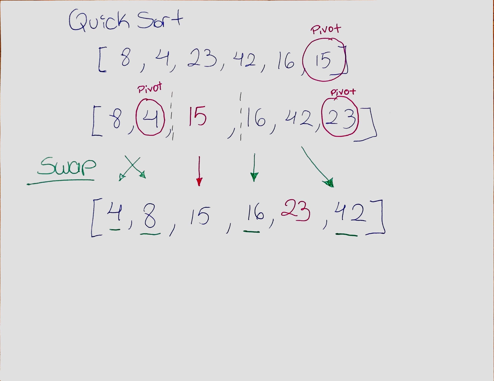

# Challenge Summary
Merge Sort items from an array. 

[LINK TO CODE](https://github.com/daesy13/data-structures-and-algorithms/blob/master/code401challenges/src/main/java/code401challenges/quickSort/QuickSort.java)</br>
[LINK TO TEST](https://github.com/daesy13/data-structures-and-algorithms/blob/master/code401challenges/src/test/java/code401challenges/quickSortTest/QuickSortTest.java)</br>

## Challenge Description
Choose some pivot element and partition your unsorted array into smaller arrays and swap them in ascending order.</br>

## Approach & Efficiency
Time: average n Log(n) & Worst Case O(n^2)</br>
The basic operation of this algorithm is comparison. This will happen n number of times, Worst case scenario if the pivot is a the smallest number or the largest number. The method will go thru the array twice wich it makes it O(n^2). In conclusion the algorithm is going to be n squared.</br></br>

Space: O(Log n)</br>
Quicksort calls itself on the order of log(n) times but worst case scenario it will call it self O(n), at each recursive call making this O (Log n).</br></br>

## Pseudo Code
```java
ALGORITHM QuickSort(arr, left, right)
    if left < right
        // Partition the array by setting the position of the pivot value 
        DEFINE position <-- Partition(arr, left, right)
        // Sort the left
        QuickSort(arr, left, position - 1)
        // Sort the right
        QuickSort(arr, position + 1, right)

ALGORITHM Partition(arr, left, right)
    // set a pivot value as a point of reference
    DEFINE pivot <-- arr[right]
    // create a variable to track the largest index of numbers lower than the defined pivot
    DEFINE low <-- left - 1
    for i <- left to right do
        if arr[i] <= pivot
            low++
            Swap(arr, i, low)

     // place the value of the pivot location in the middle.
     // all numbers smaller than the pivot are on the left, larger on the right. 
     Swap(arr, right, low + 1)
    // return the pivot index point
     return low + 1

ALGORITHM Swap(arr, i, low)
    DEFINE temp;
    temp <-- arr[i]
    arr[i] <-- arr[low]
    arr[low] <-- temp
```  

## Solution

</br></br><a href="#top">Back to top</a>
